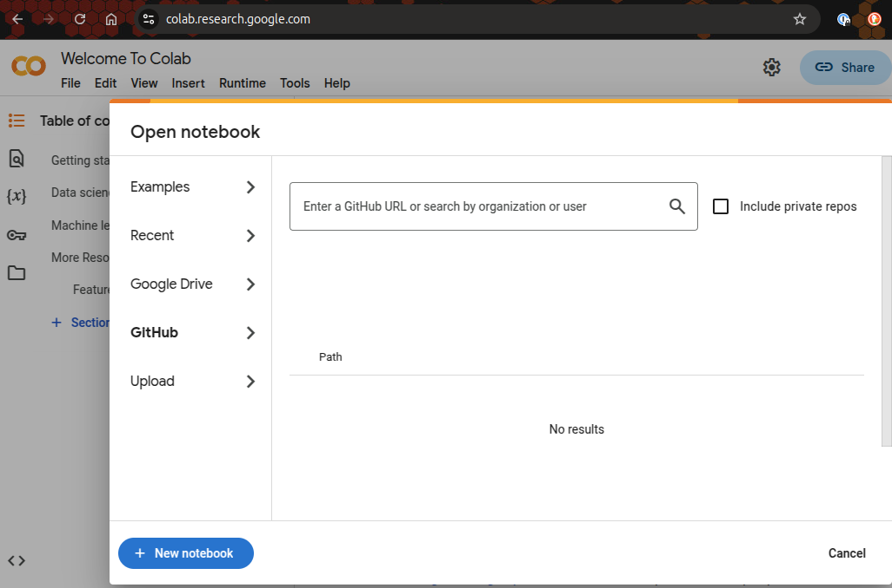

# python_quick
A quick intro to Python for C/C++/Swift programmers

Python is an incredibly versatile and powerful programming language that has
become a cornerstone in many fields, including data science, machine learning,
and web development. Its simplicity and readability make it an excellent choice
for beginners, while its extensive libraries and frameworks support complex
applications. Python's utility extends beyond these areas, offering tools for
automation, scientific computing, and more. This write-up aims to guide you through
the basics and a little beyond, using a combination of Markdown files for
theoretical explanations and Jupyter Notebooks for hands-on practice.

For those familiar with C/C++, you might expect a similar level of control over
memory management and performance optimization. However, Python's focus on ease
of use and rapid development means it abstracts away some of these low-level
details. Instead, Python excels at handling high-level tasks efficiently,
allowing you to focus on the logic and functionality of your programs without
getting bogged down in memory allocation. This write-up will help you transition
your skills to Python, leveraging its strengths to build robust and efficient
applications quickly. Through practical examples and exercises, you'll learn how
to harness Python's capabilities to achieve your programming goals.

How to run the Jupyter notebooks online?

Log in to Google Colab and clone this git repository or import the notebooks directly.

